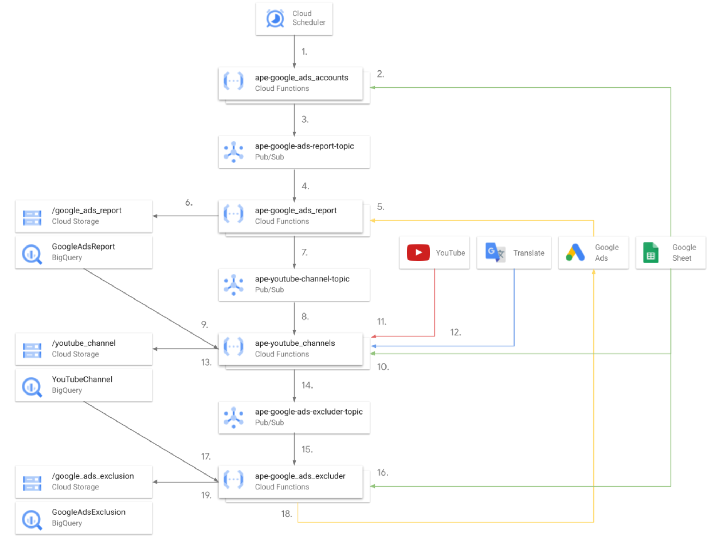

# Ads Placement Excluder Architecture

## Google Cloud Architecture

The solution is split into four microservices:

- Google Ads Account Service
- Google Ads Reporting Service
- YouTube Channel Service
- Google Ads Exclusion Service

The source code for each of the Cloud Functions can be found under the `/src/`
directory of this repo. Each function has its own README file, which contains
instructions for local deployment.

### Google Ads Account Service

This service is responsible for deciding which Google Ads accounts the Ads
Placement Excluder solution should run for, and kicking off the downstream
pipeline. Each account is pushed as a separate message into the topic to enable
concurrency.

1. Cloud Scheduler triggers the Account Cloud Function.
2. The function pulls from the Google Sheet the Google Ads customer IDs to run
   the code for, and the filters to apply to the Google Ads report.
3. Each customer ID is pushed in a separate message to Pub/Sub.

### Google Ads Reporting Service

This service is responsible for running a report from Google Ads based on the
[group_placement_view](
https://developers.google.com/google-ads/api/fields/v11/group_placement_view),
with the configured filters, and outputting that as a CSV to a Cloud Storage
bucket, with a BigQuery table in front of it. The data pulled from the report is
filtered to only have YouTube channels.

1. Pub/Sub triggers the Cloud Function.
2. The report is downloaded from Google Ads.
3. The output is written as a CSV to Cloud Storage.
4. A message is passed to the next Pub/Sub topic.

### YouTube Channel Reporting Service

This service is responsible for pulling metrics about the YouTube channels from
the Google Ads Report. For example the number of views the channel has had, and
the number of subscribers. It then uses the Google Translate API (if enabled in
the config), to determine the language the YouTube channel title is in.

1. Pub/Sub triggers the Cloud Function.
2. The function reads the new channels that were pulled from Google Ads. It does
   not refresh the data for existing channels.
3. The config is used to determine if the Translate API should be used.
4. The function pulls the YouTube data for each of the channels in step 2.
5. If the Translate API filter is enabled, for each channel it will use the API
   to detect the language and the confidence level of the prediction.
6. The output is written as a CSV to Cloud Storage.
7. A message is passed to the next Pub/Sub topic.

### Google Ads Exclusion service

The Google Ads Excluder service is responsible for applying the filters in the
config Google Sheet to the data, to determine which channels should be excluded
in Google Ads. Channels identified for exclusion are then uploaded to the shared
placement list in Google Ads, and the output written to BigQuery for reporting.

1. Pub/Sub triggers the Cloud Function.
2. The function reads the filters from the config Sheet.
3. It applies the filters to BigQuery to identify channels that need to be
   excluded.
4. These are then uploaded to Google Ads
5. The exclusions are also written to BigQuery for reporting purposes.

### Entire Solution Architecture

Combining the individual services, you can see the combined architecture diagram
below:

1. Cloud Scheduler triggers the Account Cloud Function.
2. The function pulls the Google Ads customer IDs to run the code for, and the
   filters to apply to the Google Ads report.
3. Each customer ID is pushed in a separate message to Pub/Sub.
4. Pub/Sub triggers the Cloud Function.
5. The report is downloaded from Google Ads.
6. The output is written as a CSV to Cloud Storage.
7. A message is passed to the next Pub/Sub topic.
8. Pub/Sub triggers the Cloud Function.
9. The function reads the channels that were pulled from Google Ads.
10. The config is used to determine if the Translate API should be used.
11. The function pulls the YouTube data for each of the channels in step 2.
12. If the Translate API filter is enabled, for each channel it will use the API
    to detect the language and the confidence level of the prediction.
13. The output is written as a CSV to Cloud Storage.
14. A message is passed to the next Pub/Sub topic.
15. Pub/Sub triggers the Cloud Function.
16. The function reads the filters from the config Sheet.
17. It applies the filters to BigQuery to identify channels that need to be
    excluded.
18. These are then uploaded to Google Ads
19. The exclusions are also written to BigQuery for reporting purposes.

## BigQuery External Tables Using Cloud Storage

The solution uses [BigQuery External tables with a Google Cloud Storage
backend](https://cloud.google.com/bigquery/docs/external-data-cloud-storage),
instead of writing to BigQuery directly due to concurrency. BigQuery has much
stricter limits in place about concurrent writes ([docs](
https://cloud.google.com/bigquery/quotas)), so if the solution is configured
with several Google Ads accounts, it can run into difficulty when writing
directly to BigQuery.

Leveraging Cloud Storage removes this limitation, and the
BigQuery External Table provides a way of querying the data using SQL.

## Google Ads Exclusions

There are several places that exclusions can be applied in Google Ads. This
solution applies exclusions to [shared placement exclusion lists](
https://support.google.com/google-ads/answer/9162992?hl=en-GB).

The list is configured in the configuration Google Sheet, where you enter the
customer ID of your MCC account, and the ID of the exclusion list. To find the
ID of the list, open the list in the UI and look at the value set in the query
string parameter `sharedSetId`.

## Disclaimers

__This is not an officially supported Google product.__

Copyright 2022 Google LLC. This solution, including any related sample code or
data, is made available on an “as is,” “as available,” and “with all faults”
basis, solely for illustrative purposes, and without warranty or representation
of any kind. This solution is experimental, unsupported and provided solely for
your convenience. Your use of it is subject to your agreements with Google, as
applicable, and may constitute a beta feature as defined under those agreements.
To the extent that you make any data available to Google in connection with your
use of the solution, you represent and warrant that you have all necessary and
appropriate rights, consents and permissions to permit Google to use and process
that data. By using any portion of this solution, you acknowledge, assume and
accept all risks, known and unknown, associated with its usage, including with
respect to your deployment of any portion of this solution in your systems, or
usage in connection with your business, if at all.
