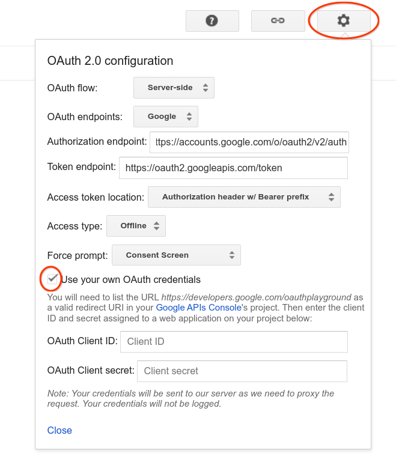
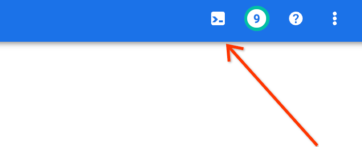

# Ads Placement Excluder Deployment

This doc provides information on how to deploy the Ads Placement Excluder
solution.

The deployment uses [Terraform](https://www.terraform.io/) to automate the
deployment, and to keep all the Infrastructure as Code (IaC). The files can be
found in the `/terraform/` folder in this repo.

## Roles
The project creates a service account with the following roles:

- `roles/cloudfunctions.invoker`
- `roles/bigquery.jobUser`
- `roles/bigquery.dataViewer`
- `roles/pubsub.publisher`
- `roles/storage.objectAdmin`

As a user deploying the project, you will require these roles and the following:

- `roles/storage.admin`
- `roles/iam.securityAdmin`

Read more about [Google Cloud roles here](
https://cloud.google.com/iam/docs/understanding-roles).

## OAuth
The project uses OAauth2.0 scopes and service account roles to manage
permissions. These are the scopes that are required when generating a refresh
token.

```
https://www.googleapis.com/auth/spreadsheets.readonly
https://www.googleapis.com/auth/cloud-platform
https://www.googleapis.com/auth/youtube
https://www.googleapis.com/auth/adwords
```

## Pre-requisites

- A new Google Cloud Project
- Appropriate permissions to be able to deploy the project (see [roles](#roles))
- Create a copy of [the template Google Sheet](
  https://docs.google.com/spreadsheets/d/1IAo8yvrY4BMuOaWnZ2O8wfJ6L36sOjCOnD7cigMxKwI/copy)
  and make a note of the Google Sheet ID (found in the URL after the `/d/`)
- Access to the appropriate Google Ads accounts
- A Google Ads [Developer Token](
  https://developers.google.com/google-ads/api/docs/first-call/dev-token)


## Deployment

### Manual Steps
These changes need to be done once manually, as they are not controlled by Terraform:

1. Open the Google Cloud Project in the UI.
2. Go to [Cloud Storage](https://console.cloud.google.com/storage/browser) and
   create a new bucket, which will be used to keep track of the Terraform state,
   e.g. `my-awesome-project-terraform`. Make a note of the name of the bucket.
3. Open the [OAuth Consent Screen](
   https://console.cloud.google.com/apis/credentials/consent) and create a new
   internal app.
4. Open the [API Credentials Screen](
   https://console.cloud.google.com/apis/credentials) -> Create credentials ->
   OAuth Client ID -> Web app -> Set
   `https://developers.google.com/oauthplayground` as an authorised redirect
   URI. Make a note of the `client_id` and the `client_secret`.
5. Open the [OAuth playground](https://developers.google.com/oauthplayground/),
   and generate a refresh token for the [above scopes](#oauth), using the
   `client_id` and `client_secret` generated in the previous step:
   
6. Open Cloud Shell:
   
7. Enable the APIs in the project by running the following:

   ```
   gcloud services enable \
      serviceusage.googleapis.com \
      cloudresourcemanager.googleapis.com \
      iam.googleapis.com \
      cloudresourcemanager.googleapis.com \
      serviceusage.googleapis.com \
      bigquery.googleapis.com \
      googleads.googleapis.com \
      youtube.googleapis.com \
      cloudfunctions.googleapis.com \
      cloudbuild.googleapis.com \
      sheets.googleapis.com \
      cloudscheduler.googleapis.com \
      translate.googleapis.com
   ```

_Side note_: If you're interested in the reason why the APIs aren't controlled
through Terraform, [read this guide](
https://medium.com/rockedscience/how-to-fully-automate-the-deployment-of-google-cloud-platform-projects-with-terraform-16c33f1fb31f).

### Terraform

1. Whilst still in Cloud shell, `git clone` the project, and `cd` into the
   directory.
2. Run the following commands to initialise Terraform:
   ```
   cd terraform
   terraform init
   ```
   When prompted, enter the name of the bucket created in step 2 in manual
   steps.

3. Create a file named `terraform.tfvars` and add the following variables:
   ```
   project_id = ""
   oauth_refresh_token = ""
   google_cloud_client_id = ""
   google_cloud_client_secret = ""
   google_ads_developer_token = ""
   google_ads_login_customer_id = ""
   config_sheet_id = ""
   ```
   Note that the `google_ads_login_customer_id` is the MCC customer ID in Google
   Ads.

4. Run `terraform plan` and review the proposed changes.
5. Run `terraform apply` to create the infrastructure.
6. The email of the service account created will be output, give view only
   access to the Google sheet containing the config.

By default, the code will be triggered every hour by Cloud Scheduler. To test
everything is working, configure the Google Sheet ([see below](#google-sheet))
and force run the Cloud Scheduler job in the UI.

## Google Sheet

Open your copy of the Google Sheet. This is what you'll be using to configure
the Ads Placement Excluder solution.

There are notes in the Sheet that contain instructions for how to set this up.

One area to highlight is the [basic Translation API](
https://cloud.google.com/translate/docs/basic/detecting-language) used in the
YouTube service, has a cost element to it ([see pricing](
https://cloud.google.com/translate/pricing)). If you want to include language
filters on the YouTube channel title, ensure that this is enabled.

If this is disabled, and then enabled at a later date, it does not backfill the
gaps in data. If you wish to backfill this data. Manually clear the files in the
Cloud Storage bucket containing the data, essentially deleting the YouTube data,
then re-run Cloud Scheduler.

## Disclaimers
__This is not an officially supported Google product.__

Copyright 2022 Google LLC. This solution, including any related sample code or
data, is made available on an “as is,” “as available,” and “with all faults”
basis, solely for illustrative purposes, and without warranty or representation
of any kind. This solution is experimental, unsupported and provided solely for
your convenience. Your use of it is subject to your agreements with Google, as
applicable, and may constitute a beta feature as defined under those agreements.
To the extent that you make any data available to Google in connection with your
use of the solution, you represent and warrant that you have all necessary and
appropriate rights, consents and permissions to permit Google to use and process
that data. By using any portion of this solution, you acknowledge, assume and
accept all risks, known and unknown, associated with its usage, including with
respect to your deployment of any portion of this solution in your systems, or
usage in connection with your business, if at all.
